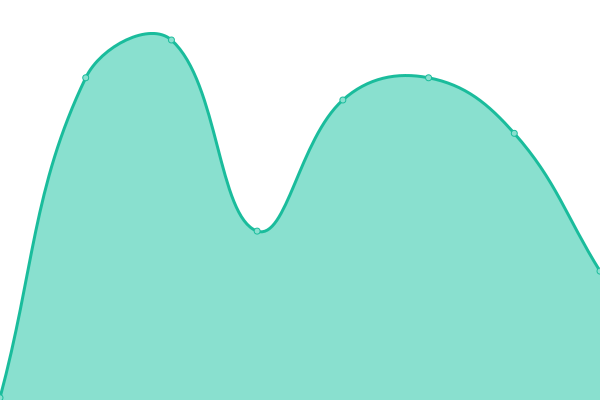
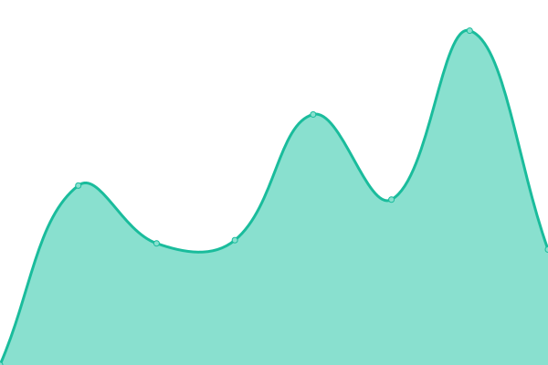
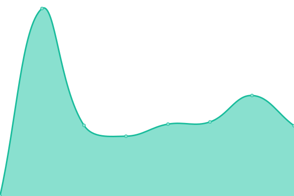
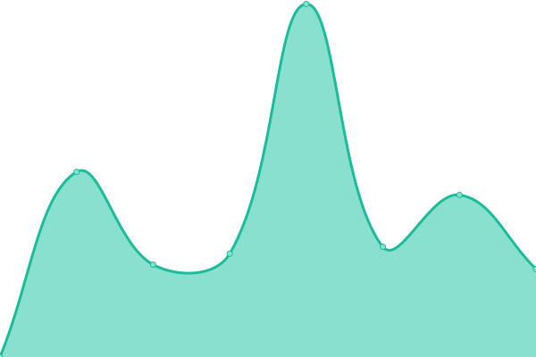
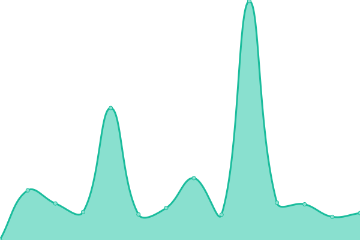
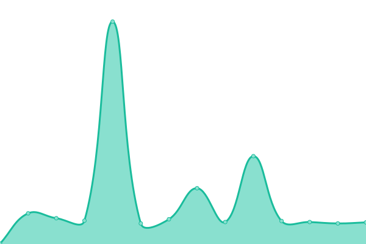
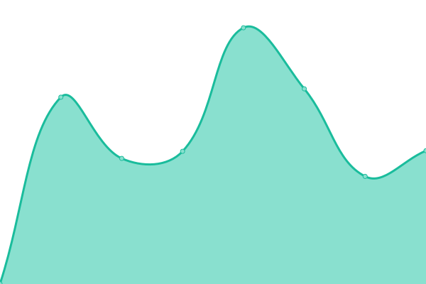
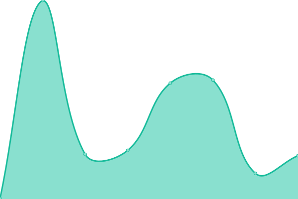

# [📈 Live Status](https://aniimah.github.io/upptime-bot): <!--live status--> **🟧 Partial outage**

This repository contains the open-source uptime monitor and status page for [aniimah](https://aniimah.github.io/upptime-bot), powered by [Upptime](https://github.com/upptime/upptime).

With [Upptime](https://upptime.js.org), you can get your own unlimited and free uptime monitor and status page, powered entirely by a GitHub repository. We use [Issues](https://github.com/aniimah/upptime-bot/issues) as incident reports, [Actions](https://github.com/aniimah/upptime-bot/actions) as uptime monitors, and [Pages](https://aniimah.github.io/upptime-bot) for the status page.

<!--start: status pages-->
<!-- This summary is generated by Upptime (https://github.com/upptime/upptime) -->
<!-- Do not edit this manually, your changes will be overwritten -->
<!-- prettier-ignore -->
| URL | Status | History | Response Time | Uptime |
| --- | ------ | ------- | ------------- | ------ |
|  [Bee and Bloom Digital](https://beeandbloom.digital/) | 🟩 Up | [bee-and-bloom-digital.yml](https://github.com/aniimah/upptime-bot/commits/HEAD/history/bee-and-bloom-digital.yml) | 

 606ms
     
 | 

<a href="https://aniimah.github.io/upptime-bot/history/bee-and-bloom-digital">100.00%</a>
    

|  [Aborfrah Online](http://aborfrahonline.com/) | 🟩 Up | [aborfrah-online.yml](https://github.com/aniimah/upptime-bot/commits/HEAD/history/aborfrah-online.yml) | 

 1520ms
     
 | 

<a href="https://aniimah.github.io/upptime-bot/history/aborfrah-online">100.00%</a>
    

|  [Accra Art Center](http://accraartscenter.com/) | 🟩 Up | [accra-art-center.yml](https://github.com/aniimah/upptime-bot/commits/HEAD/history/accra-art-center.yml) | 

 1976ms
     
 | 

<a href="https://aniimah.github.io/upptime-bot/history/accra-art-center">100.00%</a>
    

|  [Selase Kove-Seyram](https://selasekove.com/) | 🟥 Down | [selase-kove-seyram.yml](https://github.com/aniimah/upptime-bot/commits/HEAD/history/selase-kove-seyram.yml) | 

 4248ms
     
 | 

<a href="https://aniimah.github.io/upptime-bot/history/selase-kove-seyram">0.00%</a>
    

|  [Insignisncouth](http://insignisncouth.com/) | 🟥 Down | [insignisncouth.yml](https://github.com/aniimah/upptime-bot/commits/HEAD/history/insignisncouth.yml) | 

 0ms
     
 | 

<a href="https://aniimah.github.io/upptime-bot/history/insignisncouth">0.00%</a>
    

|  [Heros Animated](http://heroesanimated.com/cgi-sys/suspendedpage.cgi) | 🟥 Down | [heros-animated.yml](https://github.com/aniimah/upptime-bot/commits/HEAD/history/heros-animated.yml) | 

 352ms
     
 | 

<a href="https://aniimah.github.io/upptime-bot/history/heros-animated">0.00%</a>
    

|  [Nii Arday Clegg & Co.](http://naclegg.com/) | 🟥 Down | [nii-arday-clegg-and-co.yml](https://github.com/aniimah/upptime-bot/commits/HEAD/history/nii-arday-clegg-and-co.yml) | 

 8020ms
     
 | 

<a href="https://aniimah.github.io/upptime-bot/history/nii-arday-clegg-and-co">100.00%</a>
    

|  [NAFCO](https://nafco.gov.gh/) | 🟩 Up | [nafco.yml](https://github.com/aniimah/upptime-bot/commits/HEAD/history/nafco.yml) | 

 8582ms
     
 | 

<a href="https://aniimah.github.io/upptime-bot/history/nafco">100.00%</a>
    

|  [Tiger Eye Foundation](http://tigereyefoundation.org/) | 🟩 Up | [tiger-eye-foundation.yml](https://github.com/aniimah/upptime-bot/commits/HEAD/history/tiger-eye-foundation.yml) | 

 18069ms
     
 | 

<a href="https://aniimah.github.io/upptime-bot/history/tiger-eye-foundation">100.00%</a>
    

|  [TigerEyePi](https://www.hugedomains.com/domain_profile.cfm?d=tigereyepi&e=com) | 🟩 Up | [tiger-eye-pi.yml](https://github.com/aniimah/upptime-bot/commits/HEAD/history/tiger-eye-pi.yml) | 

 211ms
     
 | 

<a href="https://aniimah.github.io/upptime-bot/history/tiger-eye-pi">100.00%</a>
    

|  [Anas Aremeyaw Anas](https://www.hugedomains.com/domain_profile.cfm?d=tigereyepi&e=com) | 🟩 Up | [anas-aremeyaw-anas.yml](https://github.com/aniimah/upptime-bot/commits/HEAD/history/anas-aremeyaw-anas.yml) | 

 100ms
     
 | 

<a href="https://aniimah.github.io/upptime-bot/history/anas-aremeyaw-anas">100.00%</a>
    

|  [Cromwell Gray LLP](http://cromwellgray.org/) | 🟩 Up | [cromwell-gray-llp.yml](https://github.com/aniimah/upptime-bot/commits/HEAD/history/cromwell-gray-llp.yml) | 

 9343ms
     
 | 

<a href="https://aniimah.github.io/upptime-bot/history/cromwell-gray-llp">100.00%</a>
    

|  [My Sars Story](http://mysarsstory.org/) | 🟩 Up | [my-sars-story.yml](https://github.com/aniimah/upptime-bot/commits/HEAD/history/my-sars-story.yml) | 

 294ms
     
 | 

<a href="https://aniimah.github.io/upptime-bot/history/my-sars-story">100.00%</a>
    

<!--end: status pages-->

[**Visit our status website →**](https://aniimah.github.io/upptime-bot)

## 📄 License

- Powered by: [Upptime](https://github.com/upptime/upptime)
- Code: [MIT](./LICENSE) © [aniimah](https://aniimah.github.io/upptime-bot)
- Data in the `./history` directory: [Open Database License](https://opendatacommons.org/licenses/odbl/1-0/)
